# Spark + Yarn Word Count Example 

In this repository, we'll implement a simple word count example and deploy the Spark Streaming task in cluster mode on AWS EMR (1 master node and 2 core nodes). Spark and Hadoop Yarn are pre-installed using AWS EMR Console. Moreover, we'll employ AWS S3 to store data and implement the remote deployment of the Spark driver program. 

- Video: https://www.youtube.com/watch?v=w4HNnKuAgcA
- Full code: [emr_spark_wordcount_example.ipynb](emr_spark_wordcount_example.ipynb)

The overall deployment architecture is like below:

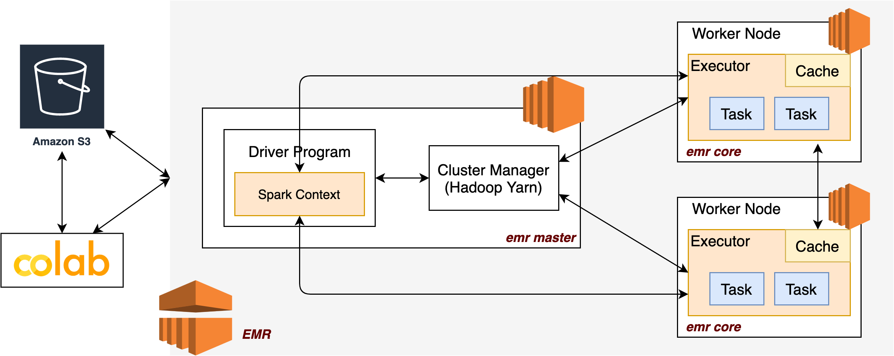

## Step 1. Create S3 Bucket
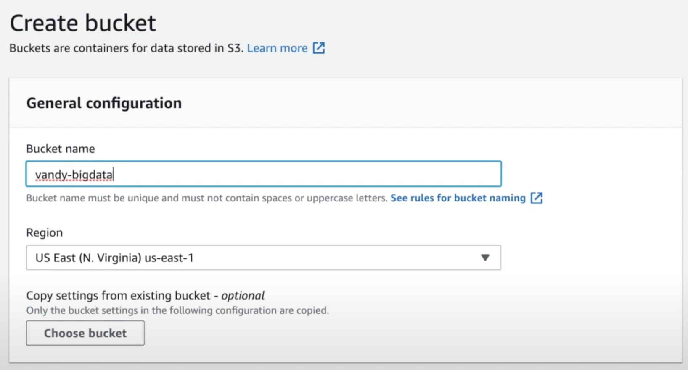

Create two folder for storing dataset and log files.

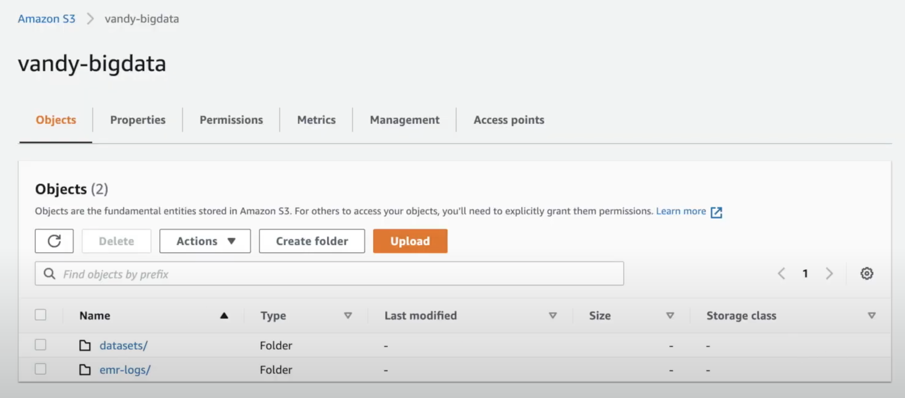

## Step 2. Create EMR Cluster

We need Hadoop (Yarn is pre-installed in Hadoop) and Spark, in which Yarn will play the role of resource manager and Spark streaming is the data processing engine.

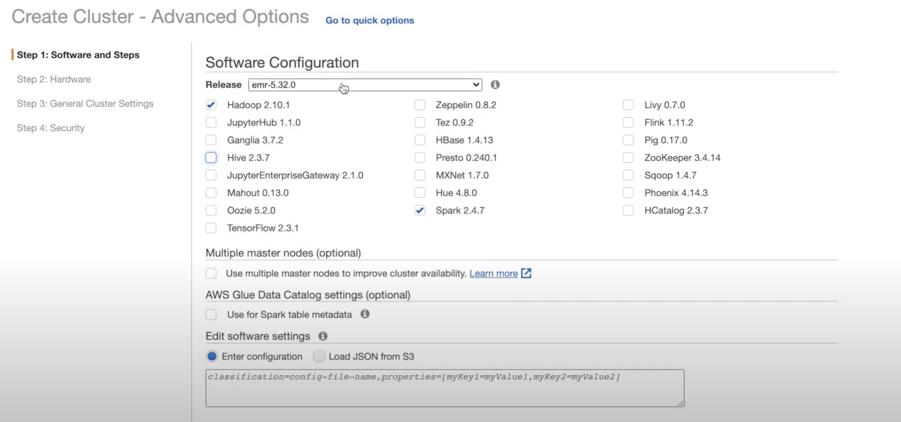

Select Spark application as we plan to run a spark streaming app.


m4.large is likely the smallest and effective image for AWS Educate account in EMR.

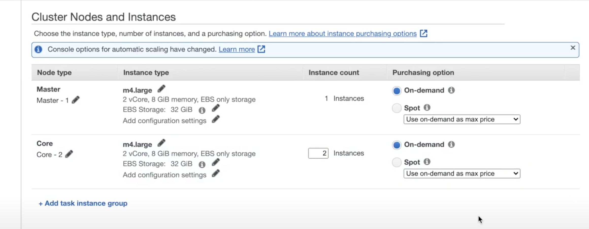

Redirect EMR log files to our pre-built S3 bucket folder. Logging and Debugging are needed for efficient programming.

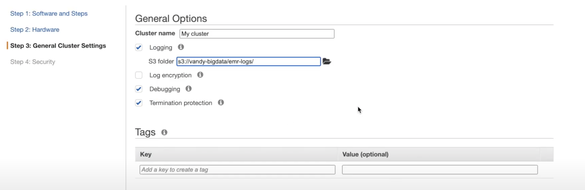

Bind your private key with EC2 instances for SSH connection.

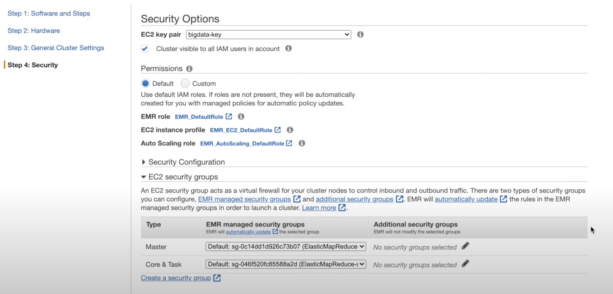

## Step 3. Word Count Example

In this example, we adopt pyspark to implement a simple word count process. Data stream is read from S3 and the processing results are save back to S3 as well.

```python
%%file PysparkStreaming.py

from pyspark import SparkContext
from pyspark.streaming import StreamingContext

sc = SparkContext(appName="PysparkStreaming")
words = sc.textFile('s3://vandy-bigdata/datasets/README.md').flatMap(lambda line: line.split(' '))
counts = words.map(lambda x: (x, 1)).reduceByKey(lambda a, b: a + b)
counts.saveAsTextFile("s3://vandy-bigdata/hw6/outputs/wordcount/")
```
Then, we upload the yielded PysparkStreaming.py to S3 programmatically using boto3.

```python
import boto3, json

with open('credentials.json') as f:
  credentials = json.load(f)

session = boto3.session.Session(**credentials)
s3 = session.client('s3')

# upload script to S3
s3.upload_file(Filename='PysparkStreaming.py', Bucket='vandy-bigdata', Key='hw6/PysparkStreaming.py')
```

Similarly, we can submit the driver program to cluster manager. The application is served as a new flow step by EMR.

```python
# submit the new spark streaming job
CLUSTER_ID = 'j-xxxxxxx'

emr = session.client('emr')
emr.add_job_flow_steps(JobFlowId=CLUSTER_ID, Steps=[{
    'Name': 'Spark Streaming',
    'ActionOnFailure': 'CANCEL_AND_WAIT',
    'HadoopJarStep': {
        'Args': ['spark-submit',
                 '--master', 'yarn',
                 '--deploy-mode', 'cluster',
                 's3://vandy-bigdata/hw6/PysparkStreaming.py'],
        'Jar': 'command-runner.jar'
    }}])
```

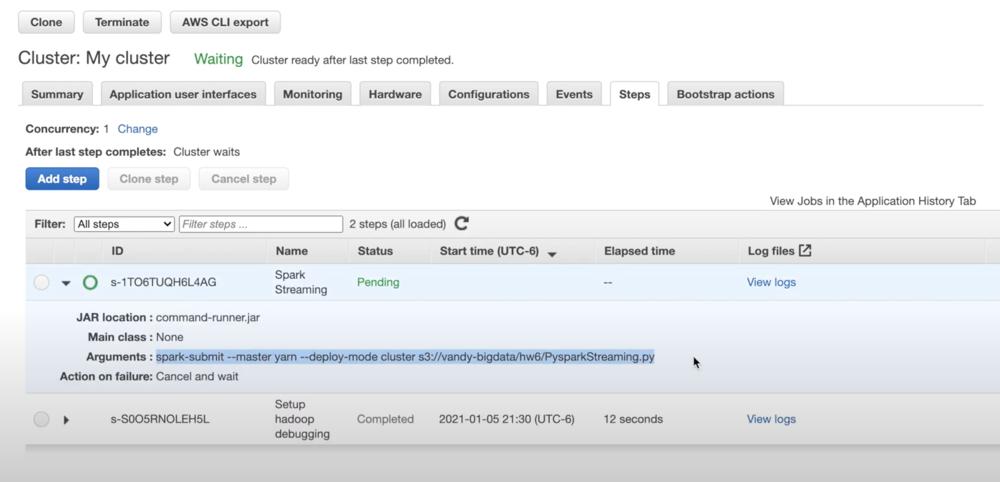

To monitor application progress, click the YARN timeline server under the Summary tab.

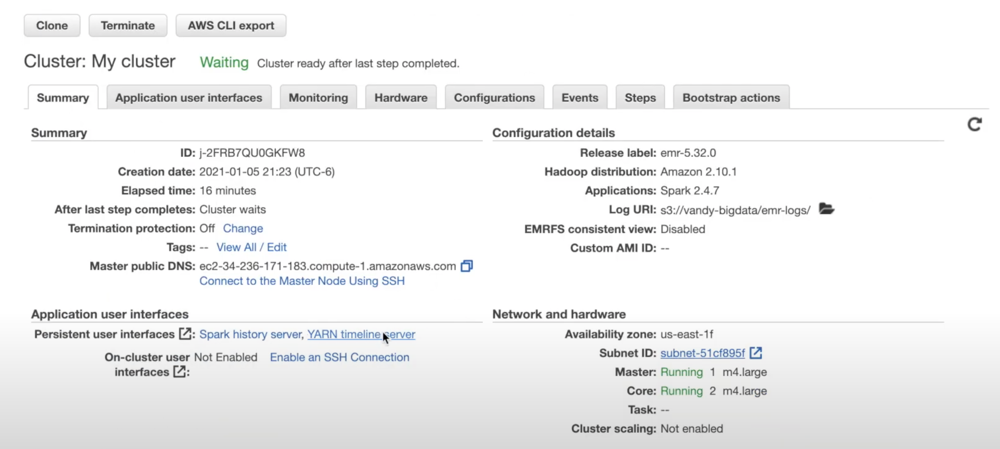
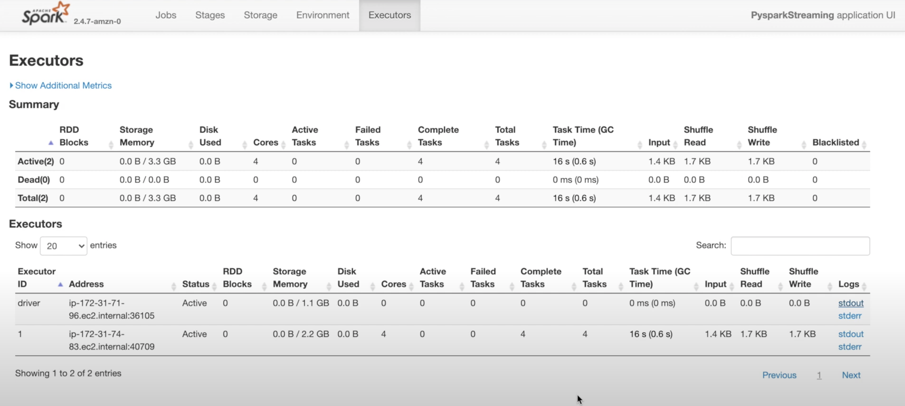

Finally, execution results are stored into S3.

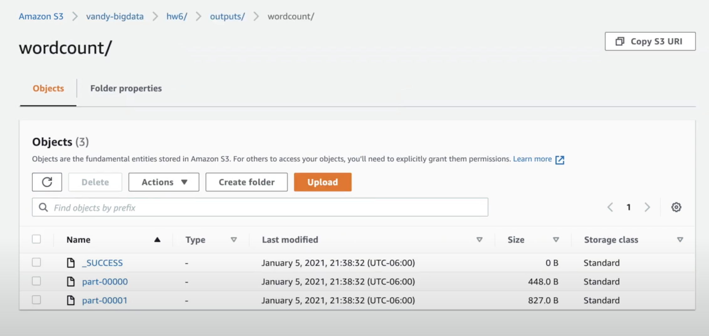