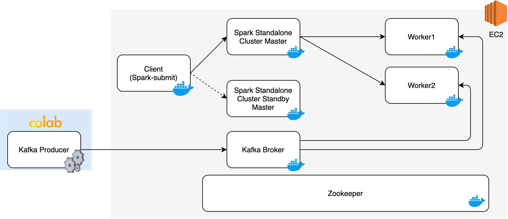

# Kakfa + Spark Streaming + Docker WorkCount Example

### This tutorial includes:

1. how to install Docker on ubuntu?
2. how to write and build a Dockerfile?
3. how to commite a running container and create a deplicate one?
4. how to run Kafka, Zookeeper, and Spark in Docker container?
5. how to set up a high available spark cluster using zookeeper?
6. how to process dataflow generated by Kafka using Spark (demostrate using a simple wordcount example)?

## [Instruction Video](https://www.youtube.com/watch?v=mJ-qRVwrMSw)

## Environment
- [EC2](https://console.aws.amazon.com/ec2/v2/home?region=us-east-1#InstanceTypeDetails:instanceType=t2.medium): 
    - OS: Ubuntu 18.04
    - Size: t2.medium (2CPU, 4GB RAM)
    - Volumn: 16GB
    - Security Group:
        - Inbound: 22, 8079-8082, 9092
        - Outbound: all
- [Spark-2.4.7-hadoop2.7](https://apache.osuosl.org/spark/spark-2.4.7/spark-2.4.7-bin-hadoop2.7.tgz)
- [Zookeeper](https://hub.docker.com/_/zookeeper)
- [Kafka](https://hub.docker.com/r/confluent/kafka)



## Step 1. Install Docker on EC2
```sh
sudo apt-get update && sudo apt-get install -y docker docker.io
# grant user root priviledge to run docker without sudo
sudo usermod -aG docker $USER
sudo reboot
```

## Step 2. Build Docker Images
```sh
./buildImages.sh <your docker hub id>
```

## Step 3. Configure Kafka advertised IP address in the configuration file
```
sed -i 's/<PUBLIC_IP>/replace here with your ec2 instance public IP/g' kafka-conf/server.properties

# for example
# sed -i 's/<PUBLIC_IP>/3.238.250.114/g' kafka-conf/server.properties
```

## Step 4. Prepare volumes that containers will mount
Copy the kafka-conf and spark-conf folder into your ec2 instance.

## Step 5. Install Containers in EC2 and Set up the cluster
```sh
./setup.sh <your docker hub id>
```

### Web UI
* Spark Master: http://\<public ip\>:8080
* Spark Standby Master: http://\<public ip\>:8079
* Spark Worker1: http://\<public ip\>:8081
* Spark Worker2: http://\<public ip\>:8082