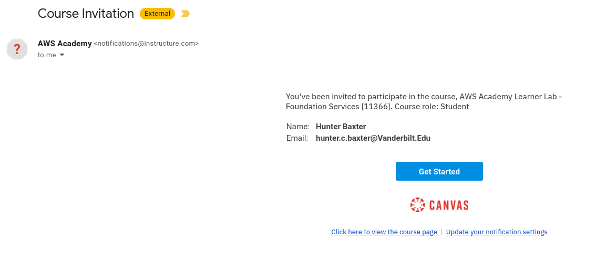
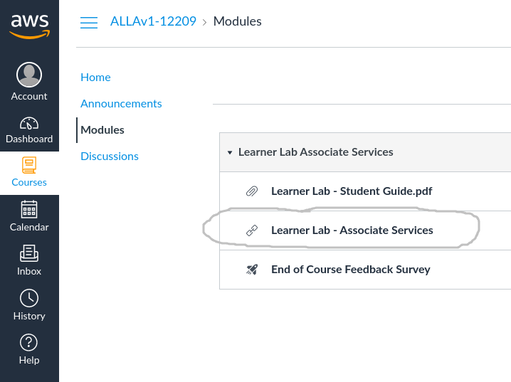
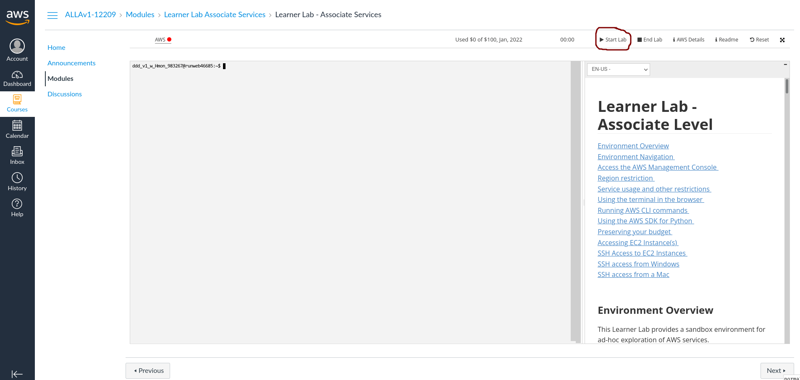
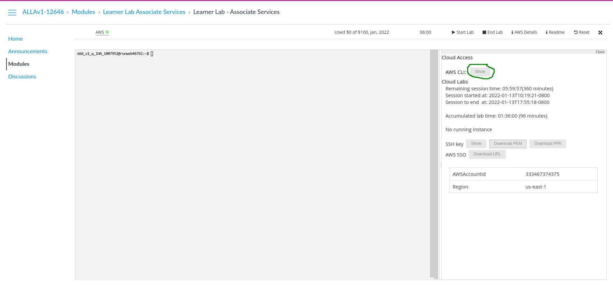
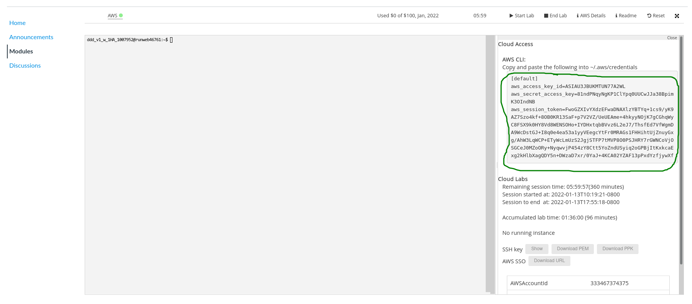
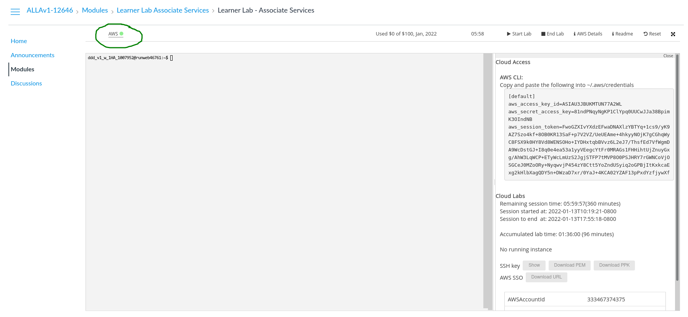
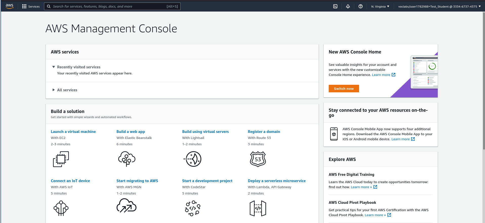

# Student Learner Lab to AWS Management Console
- log in at [Student AWS Website](https://www.awsacademy.com/SiteLogin)
- or Accept course invitation by selecting get started

**Note**  - Every student receives 100 dollars credit at the start of the semester. These credits will decrease as you use the services. Watch your credits available in your AWS console. Remember to shut off all machines when you are done and not use these services for anything other than the class work.

- make an account
- go to course dashboard by courses -> modules -> learner lab

- **read the instructions** in the frame to the right of the terminal
- start the aws lab by selecting start lab (it is ready when circle under aws is green, may take a while)

Get AWS CLI credentials by showing credentials

Copy Credentials

Click on green AWS button to get to the AWS Management console

AWS Management Console

# Other Resources
* [AWS Academy FAQ](https://aws.amazon.com/training/awsacademy/faq/)
* [AWS Leader lab Guide](student_aws_academy_learner_lab_guide.pdf)
* [AWS Services Available](aws_learner_lab_associate_account_restrictions)
