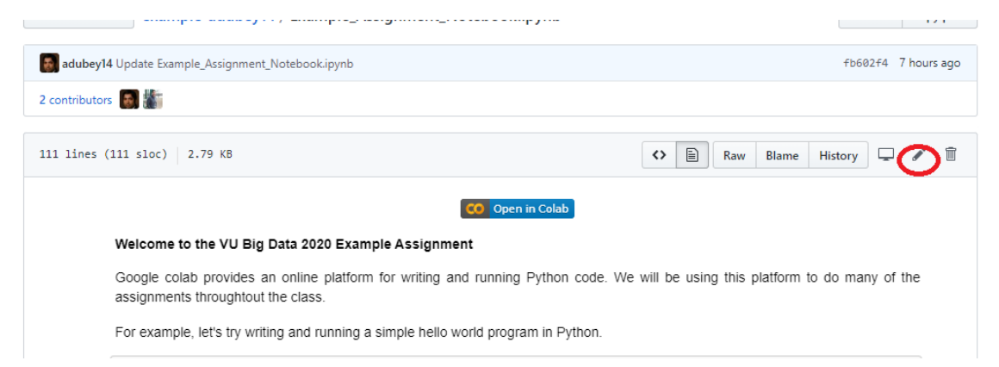
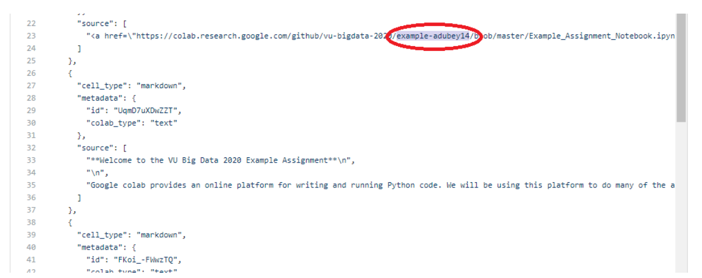

# Accepting a Github classroom assignment  and saving it in your Github

(1) Accept the assignment invitations from the github classroom sent via email

(2) Click on the assignment ipynb notebook link in github and click the edit as highlighted in red below.

(3) In the edit mode, replace the red highlighted repository name with your repository name in all the places and commit as shown below.

(4) After commiting you can see the assignment file present under your repository, you can open

